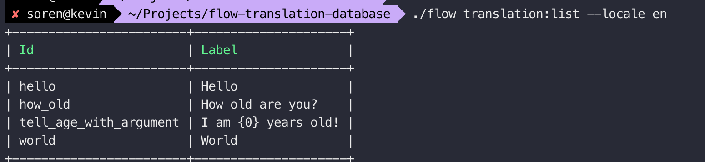
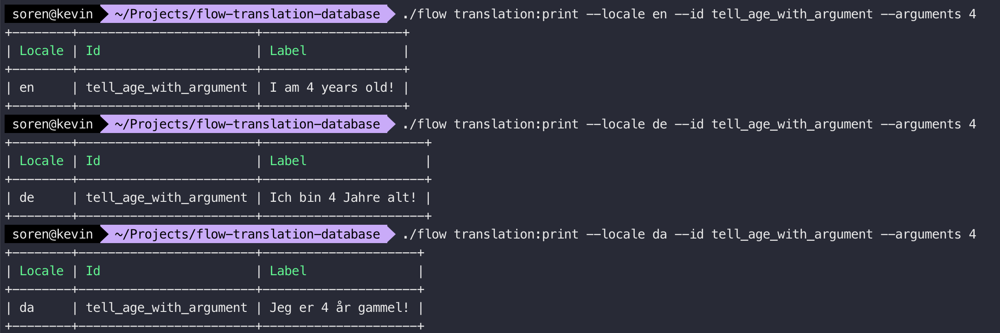

# Database Translation Provider

Working prototype of a Database provider of labels.

Goal is, to make it easy for none-developers to translate label or similar content

## Setup

### Database migrations
There is a migration creating the translation table. Run `./flow doctrine:migrate` to have that added

### Seed database with dummy labels
Run the command to seed the tables with a number of english, danish and german label

`./flow translation:seed` 

### List labels
Run the command to list the labels of a chosen locale (en,da,de)

`./flow translation:list --locale en`

### Print a single label

Run the command to print a single label

`./flow translation:print --locale en --label hello`

There is a label added with arguments named `tell_age_with_argument` - run the command again including the `--arguments` option:

`./flow translation:print --locale en --label tell_age_with_argument --arguments 4`

